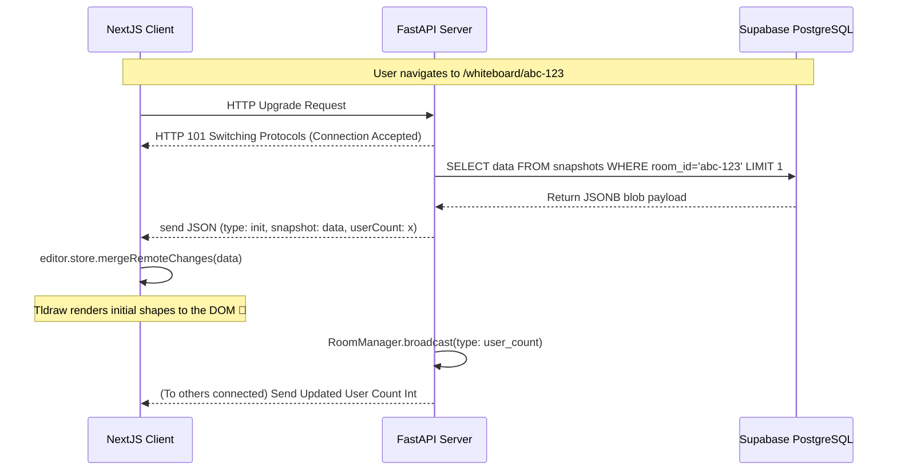
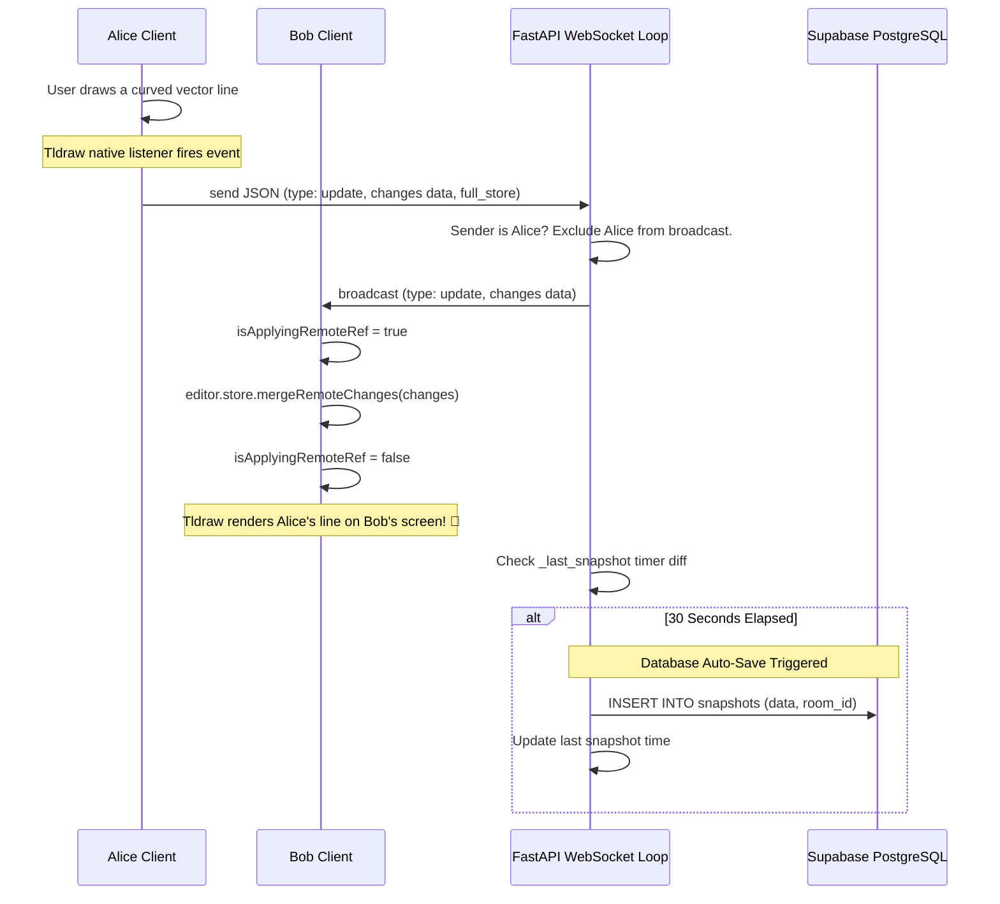

# CoWhiteboard Developer Log & Comprehensive Architecture Guide

## 1. Executive Summary

**CoWhiteboard** is a real-time, browser-based collaborative whiteboard application. It allows multiple users to join a shared room via a unique invite code, authenticate securely using Google OAuth, and concurrently draw, brainstorm, and ideate on an infinite canvas with millisecond latency.

The system is engineered for low latency, high throughput, and robust data persistence. It achieves this by combining a modern React component ecosystem (Next.js & Tldraw) on the client with an asynchronous Python WebSocket event-loop server (FastAPI) and a highly scalable PostgreSQL database (Supabase).

This document serves as the ultimate developer onboarding guide, detailing every design decision, file responsibility, sequence flow, and future scalability path.

---

## 2. Core Technology Stack & Architectural Decision Records (ADRs)

The project relies on a carefully selected stack. Each technology was chosen to solve a specific challenge in real-time collaborative applications.

### 2.1 Frontend Technologies
*   **Next.js (App Router)**: Orchestrates page routing, SEO, and static/server-side generation. The App Router (`/app`) provides a robust filesystem-based routing mechanism, allowing us to easily segregate the `/` landing page from dynamic `/whiteboard/[roomId]` sessions.
*   **React 18**: Provides the component lifecycle paradigm and context providers. We heavily utilize React Hooks (`useEffect`, `useCallback`, `useState`) to manage WebSocket reconnects and Supabase session variables.
*   **Tldraw**: A highly customized, drop-in React component (`<Tldraw />`) powering the actual drawing engine, shapes, and tools. Tldraw was chosen over custom HTML5 `<canvas>` rendering because it natively supports complex vector manipulation, infinite panning/zooming, and a built-in state machine (`editor.store`) designed specifically for multiplayer Conflict-free Replicated Data Types (CRDTs) or similar patching approaches.
*   **CSS Modules**: We use `page.module.css` to enforce localized styling and prevent CSS global scope conflicts, a common issue in large React codebases.

### 2.2 Backend Technologies
*   **FastAPI**: A high-performance Python web framework prioritizing asynchronous capabilities (`asyncio`). It was chosen over Django or Flask because of its native support for WebSockets and its built-in data validation via Pydantic.
*   **Uvicorn**: An ASGI (Asynchronous Server Gateway Interface) web server implementation. It handles the persistent TCP underlying WebSocket connections required for real-time collaboration.
*   **WebSockets (ws:// / wss://)**: The protocol enabling bi-directional, full-duplex communication over a single TCP connection. We use WebSockets instead of HTTP Long-Polling because drawing paths generate hundreds of JSON patches per second, which would overwhelm a traditional stateless HTTP request/response model.

### 2.3 Database & Authentication
*   **Supabase**: An open-source Firebase alternative built on top of PostgreSQL. It functions both as an identity provider (Auth) and our persistent database.
*   **PostgreSQL (`JSONB`)**: Relational databases traditionally struggle with the highly variable, dynamic nature of vector drawing data. However, PostgreSQL's powerful `JSONB` column type allows us to store the complex Tldraw board state as a massive, searchable JSON blob while maintaining rigid relational schema features (like `room_id` UUIDs) for authorization.

---

## 3. High-Level System Architecture

The overarching system acts natively as a Client-Server paradigm with an attached persistent state layer. While standard HTTP requests handle generic operations (login, creating rooms, downloading the initial canvas state), the WebSockets form a permanent, bi-directional tunnel between the clients and the server for millisecond-level drawing updates.

```mermaid
graph TD
    %% Entities
    ClientA[Frontend Browser<br/>Client A (Next.js/Tldraw)]
    ClientB[Frontend Browser<br/>Client B (Next.js/Tldraw)]
    FastAPI[Backend Gateway<br/>FastAPI Web Server]
    RoomMgr[Backend Memory<br/>RoomManager (Singleton)]
    SupabaseDB[(Supabase DB<br/>PostgreSQL / Auth)]

    %% HTTP Paths
    ClientA -- "1. HTTP GET: Login/Session API" --> SupabaseDB
    ClientA -- "2. HTTP GET/POST: Room Metadata" --> FastAPI

    %% WebSocket Paths
    ClientA <== "3. WSS: Canvas Diff Payloads" ==> FastAPI
    ClientB <== "3. WSS: Canvas Diff Payloads" ==> FastAPI

    %% Internal Backend Paths
    FastAPI -- "4. Subscribes users to dict" --- RoomMgr

    %% DB Hooks
    FastAPI -- "5. REST: Fetch Latest Snapshot `JSONB`" --> SupabaseDB
    FastAPI -- "6. REST: Auto-save Snapshots (Debounced)" --> SupabaseDB
```

---

## 4. Comprehensive File Structure & Component Breakdown

The workspace is rigidly divided by system boundaries (Frontend, Backend, Database) to support microservice-like independence and scaling.

```text
CoWhiteboard/
├── frontend/                 # Next.js React Application
│   ├── app/                  # Next.js 13+ App Router Map
│   │   ├── layout.tsx        # Root DOM wrapper; Supabase AuthContext injection
│   │   ├── page.tsx          # Landing page, logic for creating/joining rooms
│   │   ├── globals.css       # Global resets and CSS variable theme tokens
│   │   └── whiteboard/       # Dynamic Route grouping
│   │       └── [roomId]/     # Unique canvas sessions URL (e.g. /whiteboard/xyz123)
│   │           └── page.tsx  # Instantiates the whiteboard UI wrapper
│   │
│   ├── components/           # Reusable React UI Elements
│   │   ├── AuthProvider.tsx  # Supabase OAuth logic and React Context Provider
│   │   ├── AuthGuard.tsx     # HOC to redirect unauthenticated users
│   │   ├── Toolbar.tsx       # Custom UI tools (if extracting from Tldraw native)
│   │   └── WhiteboardCanvas.tsx # Core Tldraw Integration & WebSocket bindings
│   │
│   ├── lib/                  # Helper functions and utilities
│   │   └── supabaseClient.ts # Singleton initialization of @supabase/supabase-js
│   │
│   ├── next.config.ts        # Next.js SWC compiler settings and environment prep
│   └── package.json          # Node modules (tldraw, react, next, supabase)
│
├── backend/                  # FastAPI Python Application
│   ├── app/
│   │   ├── __init__.py       # Python module identifier
│   │   ├── main.py           # Boilerplate CORS setup, Lifespan hooks, Router mounting
│   │   ├── room_manager.py   # State machine singleton for active WebSocket I/O
│   │   ├── supabase_client.py# Supabase Python SDK wrapper singleton
│   │   ├── config.py         # OS Environment variables parsing (`pydantic-settings`)
│   │   └── routers/
│   │       ├── rooms.py      # HTTP REST Endpoints (Create Room, Query Room Metadata)
│   │       └── ws.py         # Persistent WebSocket Event Loop (Collab, Auto-save)
│   │
│   ├── requirements.txt      # Python dependencies (fastapi, uvicorn, supabase)
│   ├── railway.toml          # CI/CD deployment configuration for Railway.app
│   └── Procfile              # Traditional server execution command (gunicorn/uvicorn)
│
├── supabase/                 # Database Definitions
│   └── migration.sql         # SQL DDL Commands (Tables, Indexes, Foreign Keys)
│
└── README.md                 # Project introduction and local setup instructions
```

---

## 5. System Deep Dives

### 5.1 Frontend Deep Dive (`/frontend`)

The frontend abstracts away the massive complexity of rendering 2D vector pathing and local state caching via the `tldraw` library, focusing instead on establishing the auth context and networking bridges.

*   **`frontend/app/layout.tsx`**:
    The highest level component in the DOM tree. Critically, it wraps the entire application `children` inside the `<AuthProvider>`, guaranteeing that authentication session state is globally accessible via React hooks (`useAuth`). It also establishes SEO HTML metadata tags.

*   **`frontend/components/AuthProvider.tsx`**:
    Utilizes `@supabase/supabase-js`. On mount (`useEffect`), it attempts to restore an existing user session (`supabase.auth.getSession()`). It also attaches an `onAuthStateChange` listener to automatically update the React context if the session token expires or is refreshed. It exposes functional references like `signInWithGoogle` (initiates an OAuth redirect) and `signOut`.

*   **`frontend/app/page.tsx`**:
    The landing page. If `user` is null, it blocks room creation and prompts login. When generating a new room, it uses a cryptographically secure random number generator (`crypto.getRandomValues`) to create an 8-character string, then routes to `/whiteboard/[code]`. It temporarily persists the destination URL in `localStorage` (`redirectAfterLogin`) so the user isn't lost during the OAuth redirect hop.

*   **`frontend/components/WhiteboardCanvas.tsx`**:
    The technological heart of the client. It bridges `tldraw` state with Python WebSockets.
    *   **Instantiation**: It mounts the `<Tldraw />` component and forces a `"dark"` color scheme.
    *   **Connection & Reconnection**: Inside a `useEffect`, it instantiates `new WebSocket(WS_URL)`. It defines `ws.onclose` with a `setTimeout` to automatically re-attempt connection every 2000ms if the server drops or mobile connectivity stutters.
    *   **Listener Pattern (Tx)**: It attaches to `editor.store.listen()`. Every time the user draws, the store detects a delta change. The component intercepts this, filters for `{ source: "user" }`, and broadcasts `JSON.stringify({ type: "update", changes, data })` over the WS connection.
    *   **Conflict Resolution (Rx)**: It utilizes a clever `isApplyingRemoteRef.current` boolean mutex. When a patch arrives over the wire from remote User B (`ws.onmessage`), the flag flips `true` right before `editor.store.mergeRemoteChanges()` is invoked. This explicitly blocks the listener from endlessly echoing the exact same edit back to the server, preventing recursive broadcast loops.

### 5.2 Backend Deep Dive (`/backend`)

The backend is built stateless beside its in-memory WebSocket hashmap. It is designed to be horizontally scalable with a Redis pub/sub backplane (planned for future iteration).

*   **`backend/app/main.py`**:
    Sets up CORS to tolerate `http://localhost:3000` (development React server). Registers the FastAPI `@asynccontextmanager` lifespan to cleanly instantiate logs and potentially open/teardown database connection pools. Mounts the REST and WS routers.

*   **`backend/app/routers/rooms.py`**:
    Standard RESTful JSON endpoints. Provides POST `/api/rooms` (Generates UUID references for DB consistency) and GET `/api/rooms/{id}` (fetching the room name and a live count of connected users dynamically pulled from the RoomManager). Used for dashboard displays and metadata.

*   **`backend/app/room_manager.py`**:
    The `RoomManager` acts as an in-memory Pub/Sub message broker. It maintains a dictionary structured as: `_rooms = { "room_id": { WebSocketA, WebSocketB, WebSocketC } }`.
    *   `join_room()` / `leave_room()` dynamically appends to these buckets and logs garbage collection metrics when rooms empty out. Returns the active integer user count.
    *   `broadcast()` is an async generator method mapped across the specific bucket `_rooms[room_id]`. It iterates through the set, attempts `await ws.send_text(data)`, and traps OS `ConnectionError` exceptions to aggressively prune disconnected ("ghosting") sockets. Critically, it accepts an `exclude` parameter to skip sending the patch back to the authoring user, saving roughly 50% of the active room bandwidth.

*   **`backend/app/routers/ws.py`**:
    The WebSocket loop. This file orchestrates the real-time networking.
    1. A connection request is granted (`await websocket.accept()`).
    2. The room is registered via `_ensure_room_exists` (UPSERTs the room id into Supabase if it's brand new).
    3. **Hydration**: The application downloads the most historic snapshot blob from the `snapshots` DB table and primes the user's canvas.
    4. **Event Loop**: An infinite `while True` event loop accepts incoming text buffers via `await websocket.receive_text()`.
    5. **Routing**: It parses the JSON, looks at `msg_type` (either `"update"` or `"cursor"`). Diffs are fanned out to other users.
    6. **Auto-save Logic**: Because inserting PostgreSQL rows 60 times a second per user is unscalable, we debounce. It checks `_last_snapshot[room_id]`. If 30 elapsed seconds pass during an active drawing event (`interval >= 30`), a fire-and-forget database insert is queued up containing the FULL snapshot of the board state. This guarantees disaster-recovery while protecting the database from high IOPS constraint.

### 5.3 Database Strategy & Schema (`/supabase`)

We rely on PostgreSQL (Supabase) to handle rigid identity relations but use schemaless `JSONB` for the whiteboard objects, combining the best of SQL and NoSQL.

*   **`supabase/migration.sql`**:
    *   **`rooms` Table**: Primary structural anchor (`id UUID`). Enables setting custom user-facing names (`"Creative Brainstorm"`). Includes standard `created_at` and `updated_at` timestamps for chronological sorting.
    *   **`snapshots` Table**: The persistence mechanism. Because real-time drawing generates thousands of actions a minute, tracking every action natively in standard SQL relations (e.g. `strokes` table, `points` table, `colors` table) is catastrophic for performance. Instead, we insert bulk JSON blobs (representing every vector path array on the frame) into a `JSONB` column on a rolling basis.
    *   **Foreign Keys**: `room_id UUID NOT NULL REFERENCES rooms(id) ON DELETE CASCADE`. If a room is deleted, PostgreSQL automatically purges the gigabytes of associated snapshot history to prevent orphaned disk usage.
    *   **Indexing**: A critical performance boost is implemented via `CREATE INDEX idx_snapshots_room_created ON snapshots(room_id, created_at DESC)`. Because the WebSocket handshake must fetch the *most recent* snapshot to initialize the board, this composite B-Tree index enables an O(1) query seek time on server boot, ensuring boards load instantly even if there are hundreds of thousands of historical snapshots in the table.

---

## 6. Visual Flow Architectures

These sequence diagrams demonstrate the chronological timeline of complex multi-system interactions, useful for debugging race conditions.

### 6.1 The Initialization Handshake (Booting the Canvas)

How the system hydrates a blank canvas when a user opens an invite link. Notice the strict requirement that hydration occurs *before* any new strokes can be committed.



### 6.2 The Real-Time Synchronization Loop (Collaboration & Cursors)

How the system creates the illusion of seamless real-time collaborative ink. This loop fires immensely fast (often triggered on `mousemove` and `touchmove` events).



---

## 7. Performance Considerations & Future Scalability

As CoWhiteboard scales, the current architecture will face bottlenecks. Here is the technical roadmap for addressing them:

### 7.1 Multi-Node Clustering (The Redis Backplane)
Currently, `room_manager.py` holds state in memory. If the backend is deployed across 3 pods in Kubernetes behind a Load Balancer, User A and User B might connect to different pods and never see each other's drawings.
*   **Solution**: Introduce a Redis Pub/Sub layer. When a FastAPI worker receives a WebSocket packet, it publishes it to a Redis channel named `room:xyz`. All FastAPI workers subscribed to `room:xyz` receive the packet and emit it to their connected WebSockets.

### 7.2 Database Bloat (Snapshot Pruning)
The current auto-save logic inserts a brand new massive JSON blob row every 30 seconds a room is active. After thousands of hours of drawing, the `snapshots` table will run out of PostgreSQL disk space.
*   **Solution**: Implement a cron job (using `pg_cron` or a separate worker script) that periodically collapses history. It should DELETE all snapshots older than 24 hours, keeping only the single most recent `created_at` row per `room_id`. We do not need version history for a whiteboard.

### 7.3 Payload Compression
JSON over WebSockets is human-readable but bloated. A complex canvas can reach several megabytes in stringified JSON.
*   **Solution**: Implement `msgpack` or `Pako` (zlib/gzip Javascript compression) on the frontend before transmission. The FastAPI backend can accept binary WebSocket frames (`receive_bytes()`) instead of text.

### 7.4 Edge Deployment
Whiteboards require absolute minimal latency. If the server is in US-East-1 and a user is in Tokyo, they will experience a noticeable ~200ms lag.
*   **Solution**: Deploy the WebSocket server to the Edge (e.g., Cloudflare Workers, Fly.io regions, or Deno Deploy) closer to the individual users, rather than a centralized container.

---

*End of Developer Log. Engineered for extensive code understanding, architectural mapping, and onboarding.*
