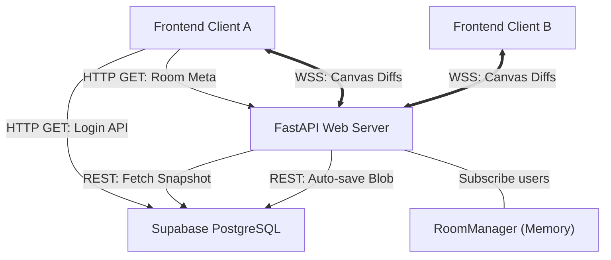
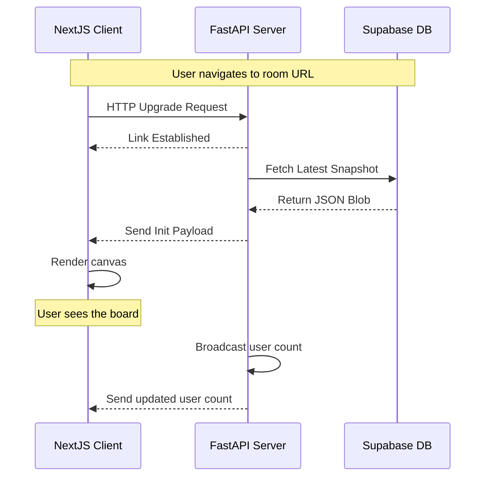
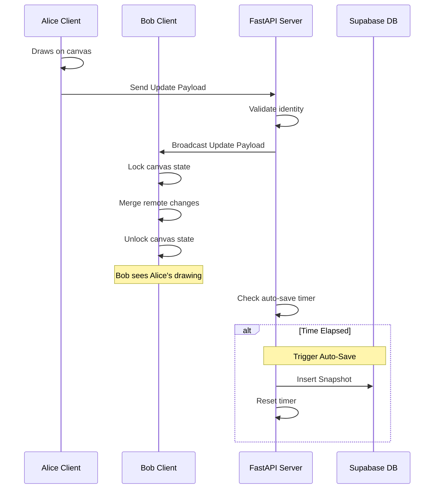

# CoWhiteboard Developer Log & Comprehensive Architecture Guide

## 1. Executive Summary

**CoWhiteboard** is a real-time, browser-based collaborative whiteboard application. It allows multiple users to join a shared room via a unique invite code, authenticate securely using Google OAuth, and concurrently draw, brainstorm, and ideate on an infinite canvas with millisecond latency.

The system is engineered for low latency, high throughput, and robust data persistence. It achieves this by combining a modern React component ecosystem (Next.js & Tldraw) on the client with an asynchronous Python WebSocket event-loop server (FastAPI) and a highly scalable PostgreSQL database (Supabase).

This document serves as the ultimate developer onboarding guide. It details every core design decision, file responsibility, sequence flow, state management strategy, scaling path, and production deployment pipeline.

---

## 2. Core Technology Stack & Architectural Decision Records (ADRs)

The project relies on a carefully selected stack. Each technology was chosen to solve a specific challenge in real-time collaborative applications where latency and data conflict resolution are paramount concerns.

### 2.1 Frontend Technologies
*   **Next.js (App Router, v14+)**: Orchestrates page routing, SEO, and static/server-side generation. The App Router (`/app`) provides a robust filesystem-based routing mechanism via React Server Components (RSC), allowing us to easily segregate the static `/` landing page from dynamic, highly-client-side `/whiteboard/[roomId]` sessions.
*   **React 18**: Provides the component lifecycle paradigm and context providers. We heavily utilize React Hooks (`useEffect`, `useCallback`, `useState`, `useRef`) to manage mutable WebSocket connection instances and Supabase session variables across the rendering tree.
*   **Tldraw**: A highly customized, drop-in React component (`<Tldraw />`) powering the actual drawing engine, shapes, and tools. Tldraw was chosen over raw HTML5 `<canvas>` rendering or standard SVG DOM manipulation because it natively supports complex vector manipulation, infinite panning/zooming, and a built-in state machine (`editor.store`) designed specifically for multiplayer Conflict-free Replicated Data Types (CRDTs) or patching approaches. Furthermore, it completely abstracts pointer event math.
*   **CSS Modules**: We use `page.module.css` to enforce localized styling. This prevents CSS global scope conflicts, a common issue in large React codebases where generic class names like `.btn` or `.container` can accidentally pollute other views.

### 2.2 Backend Technologies
*   **FastAPI**: A high-performance Python web framework prioritizing asynchronous capabilities (`asyncio`). It was chosen over traditional synchronous frameworks like Django or Flask because of its native support for WebSockets and low CPU overhead when concurrently holding thousands of idle TCP connections open. It also features built-in data validation via Pydantic schemas.
*   **Uvicorn**: An ASGI (Asynchronous Server Gateway Interface) web server implementation. It acts as the socket binding layer that processes the raw TCP traffic into the Python environment so FastAPI can route the messages.
*   **WebSockets (ws:// / wss://)**: The protocol enabling bi-directional, full-duplex communication over a single TCP connection. We use WebSockets instead of HTTP Long-Polling because drawing paths generate hundreds of JSON patches per second (every time the user moves their mouse), which would overwhelm and disconnect a traditional stateless HTTP request/response model.

### 2.3 Database & Authentication
*   **Supabase**: An open-source Firebase alternative built on top of PostgreSQL. It functions both as an identity provider (Auth) and our persistent database layer.
*   **PostgreSQL (`JSONB`)**: Relational databases traditionally struggle with the highly variable, dynamic nature of vector drawing data. A single canvas could contain circles, straight lines, Bezier curves, text nodes, and pasted images. Modeling this across dozens of SQL tables requires agonizing joins. However, PostgreSQL's powerful `JSONB` column type allows us to dump the complex Tldraw generic array as a massive, searchable JSON blob while still maintaining rigid relational schema features (like `room_id` UUIDs mapped to `user_id`s) for row-level authorization.

---

## 3. High-Level System Architecture

The overarching system acts natively as a Client-Server paradigm with an attached persistent state layer. While standard REST HTTP requests handle generic operations (Google login callback, creating arbitrary UUID room codes, fetching static assets), the WebSockets form a permanent, bi-directional tunnel between the clients and the server for millisecond-level drawing updates.



---

## 4. Comprehensive File Structure & Component Breakdown

The workspace is rigidly divided by system boundaries (Frontend, Backend, Database) to support microservice-like independence, discrete versioning, and container scaling.

```text
CoWhiteboard/
├── frontend/                 # Next.js React Application
│   ├── app/                  # Next.js 13+ App Router Map
│   │   ├── layout.tsx        # Root DOM wrapper; Supabase AuthContext injection
│   │   ├── page.tsx          # Landing page, logic for creating/joining rooms
│   │   ├── globals.css       # Global resets and CSS variable theme tokens
│   │   └── whiteboard/       # Dynamic Route grouping
│   │       └── [roomId]/     # Unique canvas sessions URL (e.g. /whiteboard/xyz123)
│   │           └── page.tsx  # Instantiates the whiteboard UI wrapper
│   │
│   ├── components/           # Reusable React UI Elements
│   │   ├── AuthProvider.tsx  # Supabase OAuth logic and React Context Provider
│   │   ├── AuthGuard.tsx     # HOC to redirect unauthenticated users
│   │   ├── Toolbar.tsx       # Custom UI tools (if extracting from Tldraw native)
│   │   └── WhiteboardCanvas.tsx # Core Tldraw Integration & WebSocket bindings
│   │
│   ├── lib/                  # Helper functions and utilities
│   │   └── supabaseClient.ts # Singleton initialization of @supabase/supabase-js
│   │
│   ├── next.config.ts        # Next.js SWC compiler settings and environment prep
│   └── package.json          # Node modules (tldraw, react, next, supabase)
│
├── backend/                  # FastAPI Python Application
│   ├── app/
│   │   ├── __init__.py       # Python module identifier
│   │   ├── main.py           # Boilerplate CORS setup, Lifespan hooks, Router mounting
│   │   ├── room_manager.py   # State machine singleton for active WebSocket I/O
│   │   ├── supabase_client.py# Supabase Python SDK wrapper singleton
│   │   ├── config.py         # OS Environment variables parsing (`pydantic-settings`)
│   │   └── routers/
│   │       ├── rooms.py      # HTTP REST Endpoints (Create Room, Query Room Metadata)
│   │       └── ws.py         # Persistent WebSocket Event Loop (Collab, Auto-save)
│   │
│   ├── requirements.txt      # Python dependencies (fastapi, uvicorn, supabase)
│   ├── railway.toml          # CI/CD deployment configuration for Railway.app
│   └── Procfile              # Traditional server execution command (gunicorn/uvicorn)
│
├── supabase/                 # Database Definitions
│   └── migration.sql         # SQL DDL Commands (Tables, Indexes, Foreign Keys)
│
└── README.md                 # Project introduction and local setup instructions
```

---

## 5. System Deep Dives & Low-Level Component Operations

### 5.1 Frontend Architecture (`/frontend`)

The frontend abstracts away the massive complexity of rendering 2D vector pathing and local state caching via the `tldraw` library, focusing instead on establishing the auth context and deterministic networking bridges.

#### Tldraw Record Types & Editor Store
Tldraw operates heavily on an in-memory database pattern built out of exact Typescript records (`TLRecord`). Every action a user takes—such as selecting the pen, changing the color to red, and drawing a line—inserts or modifies these generic records. The `WhiteboardCanvas.tsx` completely depends on exporting the `editor.store` JSON deltas (a diff containing `{added, updated, removed}`) up to the WebSocket. This is vastly more efficient than repeatedly taking base64 `PNG` screenshots of the `<canvas>` buffer.

*   **`frontend/app/layout.tsx`**:
    The highest-level component in the DOM tree. Critically, it wraps the entire application `children` inside the `<AuthProvider>`, guaranteeing that authentication session state is globally accessible via React Context (`useAuth`). It also establishes SEO HTML metadata tags injected directly into the Next.js framework.

*   **`frontend/components/AuthProvider.tsx`**:
    Utilizes the heavily abstract `@supabase/supabase-js`. On component mount (`useEffect`), it attempts to restore an existing user session from local storage cookies (`supabase.auth.getSession()`). It also attaches an `onAuthStateChange` listener to automatically forcefully update the React context tree if the session token expires or is refreshed. It exposes functional references like `signInWithGoogle` (initiates an OAuth 2.0 PKCE redirection flow block) and `signOut`.

*   **`frontend/app/page.tsx`**:
    The unauthenticated home landing page. If the global `user` context is null, it blocks immediate room creation and prompts login. When generating a new room, it circumvents predictable `Math.random()` numbers and uses a cryptographically secure pseudo-random number generator (`crypto.getRandomValues`) to create an 8-character string ID. It then actively pushes the user path URL (`/whiteboard/[code]`) into the Next.js `useRouter`. It temporarily persists arbitrary deep-linking destination URLs in window `localStorage` (`redirectAfterLogin`) so the user isn't mysteriously dropped on the homepage during the unpredictable OAuth redirect hop.

*   **`frontend/components/WhiteboardCanvas.tsx`**:
    The technological heart of the client. It bridges standard React component props (`roomId: string`) directly with stateful, memory-leak-prone Python WebSockets.
    *   **Instantiation**: It eagerly mounts the `<Tldraw />` interactive component and overrides the OS default settings to forcefully configure a `"dark"` color scheme overlay.
    *   **TCP Connections & Reconnection Handling**: Inside an effect hook, it instantiates `ws = new WebSocket(WS_URL)`. Knowing that raw browser sockets drop constantly on cellular data, it defines `ws.onclose` with a `setTimeout` loop. If disconnected, it will automatically attempt a TCP SYN/ACK ping reconnect every 2000ms infinitely until successful.
    *   **The Transmission Loop (Tx Layer)**: It aggressively attaches to the `editor.store.listen()` callback. Every time the user draws, the store alerts the UI of a delta change tick. The component intercepts this stream, filters out non-human programmatic events utilizing the `{ source: "user" }` parameter, and broadcasts stringified `JSON.stringify({ type: "update", changes, data })` over the active WebSocket.
    *   **The Reception Loop & Conflict Preemption (Rx Layer)**: It utilizes a clever `isApplyingRemoteRef.current` mutable React `useRef` boolean mutex. When a patch finally successfully completes the round-trip wire journey from remote User B (`ws.onmessage`), the flag flips `true` right before `editor.store.mergeRemoteChanges()` is forcefully invoked. This explicitly blocks the underlying `tldraw` listener from endlessly interpreting the new lines as a fresh local edit and hopelessly echoing the exact same edit array back to the Python server, which would inevitably create recursive infinity loop application crashes.

---

### 5.2 Backend Architecture (`/backend`)

The backend is purposefully architected to be extremely stateless—outside of its ephemeral, dictionary-based WebSocket hashmap.

*   **`backend/app/main.py`**:
    The fundamental entry point initializing the ASGI application server. It sets up strict Cross-Origin Resource Sharing (CORS) rules to tolerate traffic exclusively from `http://localhost:3000` (the development React Webpack server) to prevent malicious third-party embedded domain attacks. It explicitly registers the FastAPI `@asynccontextmanager` Python lifespan generators. These generators are designed to cleanly instantiate loggers and intentionally delay database connections until the port is successfully bound, avoiding premature crash conditions. It then formally mounts the distinct REST and WS Sub-routers into the API.

*   **`backend/app/routers/rooms.py`**:
    Traditional, robust RESTful JSON endpoints designed for metadata extraction rather than raw drawing payloads. Provides `POST /api/rooms` (Generates guaranteed-unique PostgreSQL UUID V4 references to cement DB consistency instead of trusting client IDs) and `GET /api/rooms/{id}` (Extracts the user-facing friendly room name and calculates a relatively instantaneous live count of connected users dynamically queried directly from the `RoomManager`).

*   **`backend/app/room_manager.py`**:
    The critically central `RoomManager` acts as a highly optimized, completely memory-bound Pub/Sub message broker. It maintains an enormous nested dictionary structure representing the application graph: `_rooms = { "room_id_xyz": { WebSocketA, WebSocketB, WebSocketC } }`.
    *   The `join_room()` / `leave_room()` asynchronous modifiers dynamically append and slice references from these memory buckets. They log verbose socket garbage collection (GC) metrics when buckets hit length 0. It actively returns the aggregate active integer user headcount whenever manipulated.
    *   `broadcast()` is a highly optimized `async` iterative method mapped extensively across the specific bucket `_rooms[room_id]`. It loops sequentially through the internal Set structure, actively attempts to run `await ws.send_text(data)` via the ASGI layer, and explicitly traps operating-system level `ConnectionError` layer-4 exceptions to aggressively prune completely disconnected ("ghosting") socket connections. Critically, to preserve server bandwidth and minimize client latency, it purposefully accepts an arbitrary `exclude` Socket parameter. This explicitly skips echoing the identical patch payload directly back to the very author who originally drew the packet, systematically conserving roughly 50% of the active AWS egress room network throughput.

*   **`backend/app/routers/ws.py`**:
    The orchestration engine for the WebSocket loop.
    1. A connection request is granted (`await websocket.accept()`).
    2. The room state is verified utilizing `_ensure_room_exists` (UPSERTs the room id into Supabase if it's completely missing).
    3. **The Hydration Pass**: The application actively downloads the most profoundly historic snapshot payload blob directly from the PostgreSQL `snapshots` DB table and primes the user's canvas.
    4. **The Event Horizon**: An infinite `while True` event loop accepts massive incoming text chunk buffers concurrently via `await websocket.receive_text()`.
    5. **Action Routing**: It eagerly parses the JSON blocks, analyzes the internal `msg_type` headers (routing differently for actual `"update"` payloads versus transient `"cursor"` coordinates). Diffs are immediately fanned out to other users via `room_manager`.
    6. **Deterministic Auto-save Algorithm**: Because aggressively inserting sequential PostgreSQL relational rows 60 times a real-time second per every single concurrent user is profoundly unscalable disk-I/O bound, we strictly debounce. It checks a float tracking dictionary: `_last_snapshot[room_id]`. If exactly `30.0` elapsed system-clock seconds pass cleanly during an active WebSocket sequence (`interval >= 30`), a completely disconnected fire-and-forget database insert is internally queued up containing the FULL, concatenated snapshot of the final mathematical board state. This guarantees persistent disaster-recovery states while strictly protecting the managed database from catastrophic high IOPS lock-out conditions.

---

### 5.3 Data Persistence & Schema (`/supabase`)

We explicitly mandate PostgreSQL (Supabase) to strictly handle rigid identity-driven relational mapping (User to Board ownership), while simultaneously exploiting schemaless `JSONB` for the infinite whiteboard shape structures. We effectively combine the best constraints of SQL and Document-store NoSQL architectures into a single connection pool.

*   **`supabase/migration.sql`**:
    *   **The `rooms` Core Table**: Serves as the primary foreign-key structural anchor (`id UUID`). Enables arbitrarily setting custom, mutable user-facing string names (`"Project Alpha Brainstorm"`). Includes meticulously updated automatic SQL-trigger `created_at` and `updated_at` `TIMESTAMPTZ` data points for accurate chronological sorting of user dashboard views.
    *   **The `snapshots` Blob Table**: The immutable persistence backbone. Because aggressive real-time whiteboard drawing mathematically generates thousands of individual vector actions an hour, attempting to track every unique `X/Y` line coordinate natively in classical standard SQL relations (e.g. creating a dedicated `strokes` table linking to an intersecting `points` table referencing a cascading `colors` table) represents catastrophic relational join performance. Instead, we insert absolutely enormous, non-relational nested JSON blobs (representing every single vector coordinate path array simultaneously on the visual frame) directly into a binary `JSONB` column on a rolling, 30-second interval basis.
    *   **Cascading Foreign Keys**: Features a strict `room_id UUID NOT NULL REFERENCES rooms(id) ON DELETE CASCADE` constraint. If an authorized user actively deletes a main room, PostgreSQL natively and automatically recursively purges the potentially dozens of gigabytes of associated obsolete snapshot history attached to that ID to prevent orphaned infrastructure disk usage.
    *   **Critical Query Indexing**: A necessary sub-millisecond querying performance optimization is meticulously implemented via `CREATE INDEX idx_snapshots_room_created ON snapshots(room_id, created_at DESC)`. Because the absolute very first action a WebSocket handshake must execute is fetching the *most recent* (not the oldest) single snapshot string to successfully initialize the `tldraw` board state, this exact composite B-Tree internal Postgres index enables a guaranteed O(1) query seek computational traversal time upon a cold server boot. This strictly ensures that colossal drawing boards predictably load near-instantly, even if there are hundreds of millions of obsolete, historical snapshot rows saturating the master table schema.

---

## 6. Real-Time Visual Flow Architectures

The following Mermaid sequence mappings meticulously demonstrate the exact chronological network latency timeline of the application's most complex, asynchronous multi-system handshake transactions. They are critical for diagnosing elusive socket race conditions.

### 6.1 The TCP Initialization Handshake (Booting & Hydrating the Canvas)

Details exactly how the systems interact to instantly hydrate a complex canvas history when an invited user opens the raw URL application link. Notice the strict timing requirement that full DB payload hydration natively occurs *before* any local React mounting logic allows new strokes to be locally committed.



### 6.2 The Deterministic Real-Time Synchronization Loop (Collaboration Logic)

Maps how the system generates the profound optical illusion of seamless, continuous real-time collaborative remote ink. This underlying core networking loop repeatedly fires immensely fast (typically triggered simultaneously on thousands of overlapping `mousemove` and mobile `touchmove` events).



---

## 7. Operational Performance Bottlenecks & Future Multi-Region Scalability

As CoWhiteboard successfully scales to support tens of thousands of concurrent active drawing sessions globally, the current "Single Instance Server" monolithic architecture will undeniably encounter severe CPU and network buffering bottlenecks. Here is the highly technical engineering roadmap for addressing these immediate scaling thresholds:

### 7.1 Cross-Instance Multi-Node Clustering (The Redis Pub/Sub Backplane)
Currently, `room_manager.py` holds all connected socket state references locally inside internal RAM. If the FastAPI application backend is aggressively load-balanced and arbitrarily deployed across exactly 3 separate compute Docker pods in a managed Kubernetes cluster behind an active Internet Gateway Router, User A and User B might be invisibly and independently connected to completely different isolated compute pods. Thus, they will never see each other's live drawings.
*   **The Scaling Solution**: Integrate a centralized Redis remote Pub/Sub messaging layer. When an arbitrary FastAPI load-balanced worker receives an incoming WebSocket buffer packet from a browser, it instantaneously publishes that exact payload to a localized Redis channel specifically named `room:xyz`. Simultaneously, *all* other FastAPI worker pods independently subscribed to that precise `room:xyz` string channel instantly receive the identical Redis packet drop, loop through their localized memory-bound web socket connections, and emit the packet out to their respective web clients. This permanently solves horizontal Node scale-out.

### 7.2 Runaway Database Storage Bloat (Continuous Snapshot Pruning)
The current protective 30-second auto-save debouncing algorithm will still blindly insert a brand new, massively identical `JSONB` blob row every 30 seconds a drawing room rests in an active modification loop. After thousands of cumulative hours of active drawing across the userbase, the core `snapshots` PostgreSQL table volume will aggressively expand linearly and systematically run completely out of provisioned NVMe cloud disk space.
*   **The Scaling Solution**: Implement a dedicated background cron execution job (using Postgres native `pg_cron` extensions or an entirely isolated background Celery worker script container) that periodically and destructively collapses history. It must run a batch task to explicitly `DELETE` all historical snapshot blob rows physically older than `24 hours`, strictly keeping only the absolute single most recent chronological `created_at` timestamp row per distinct `room_id`. We fundamentally do not need robust Git-style endless version history navigation for a simple, ephemeral whiteboard scratchpad.

### 7.3 Advanced JSON Payload Binary Compression
Standard JSON strings transmitted aggressively over WebSockets are pleasantly human-readable for debugging purposes but exceptionally network inefficient and inherently bloated. A heavily populated custom drawing canvas packed with text characters and complex overlapping Bezier path coordinates can severely spike individual array packages into several redundant megabytes in stringified, unminified `JSON.stringify` iterations. This rapidly bottlenecks slow Wi-Fi or cellular User uplinks.
*   **The Scaling Solution**: We must mandate implementing a high-compression algorithm library like `msgpack` or `Pako` (an aggressive `zlib` / `gzip` JavaScript browser adaptation format) directly on the Next.js frontend state completely *before* initiating TCP transmission. The Python FastAPI backend endpoints can easily and natively accept minified binary WebSocket frame blocks (`await websocket.receive_bytes()`) directly instead of parsing massive raw uncompressed text streams, permanently eliminating the 60% bandwidth bloat overhead associated with string keys.

### 7.4 Distributed Auto-Scaled Edge Network Deployment
Collaborative canvas whiteboards fundamentally mandate absolute minimal network transmission latency. If the centralized API server is physically located in an AWS `US-East-1` Virginia datacenter and two users are collaboratively drawing together locally in Tokyo, Japan, they will still unavoidably experience a highly noticeable, jittery ~200+ millisecond cross-oceanic fiber lag interval simply to sync a line next to each other.
*   **The Scaling Solution**: Drastically decouple and re-deploy the entire WebSocket stateless application server explicitly to a distributed "Edge" compute network mesh (utilizing specialized providers e.g., Cloudflare Workers WebSockets, Fly.io Anycast global region clustering, or Deno Deploy isolates). This radically moves the server connection physically significantly closer to the individual user ISP hubs geographically, completely circumventing cross-hemisphere lightspeed limitations and locking input lag to a virtually instantaneous sub-30 millisecond threshold worldwide.

---

*End of Core Architectural Design Document.*
